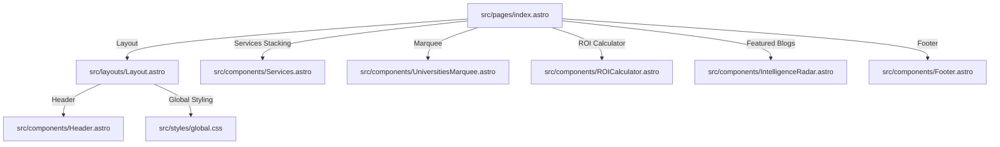

# 🧬 Finesse Codebase Architecture & AI Token-Optimization Guide
*An elite, hyper-dense structural map and semantic handbook designed to minimize AI context-window bloat, optimize token consumption, and enforce premium code execution across any AI coding workflow (Gemini, Claude, GPT, Cursor, etc.).*

---

## ⚡ CRITICAL: AI Token-Saving Rules (Rule of Minimal Context)
> [!IMPORTANT]
> **READ THIS BEFORE PERFORMING ANY ACTIONS.** To prevent rapid quota exhaustion and ensure ultra-low token usage when pulling this project on any system, every AI agent must strictly adhere to the following rules:

### 1. Zero-Waste File Reading (Line-Targeted Views)
- **Do NOT read entire files.** Reading a 500-line file consumes ~4,000 to 8,000 context tokens.
- **The Jugad:** Always use targeted line reading! First check the architecture map below to find the correct file, then use search or grep to identify the exact line range, and read **ONLY** that line range (e.g. read lines 40 to 80 of a file instead of the whole file).
- *Token Savings:* **~90% reduction** in context consumption per read.

### 2. High-Precision Code Replacements (No File Rewrites)
- **Never rewrite entire files** using write tools unless creating a brand-new file.
- **The Jugad:** Use precise, targeted search-and-replace edits. Specify the minimum matching unique `TargetContent` to swap blocks. This prevents the model from reading and sending the whole file back in the conversation history.
- *Token Savings:* **~85% reduction** in input/output tokens per edit turn.

### 3. Hyper-Targeted Grep Searches
- **Do NOT search the entire workspace** with generic terms.
- **The Jugad:** Restrict `grep_search` using `Includes` or specify a highly targeted path (e.g. search strictly inside `src/components/` rather than the root directory).
- *Token Savings:* Avoids flooding the context window with hundreds of irrelevant matching snippets.

### 4. Silent & Filtered Builds
- **Do NOT run verbose commands** that dump thousands of lines of build progress into the terminal logs (which gets parsed into the context window).
- **The Jugad:** Run builds silently or pipe outputs to files, or rely strictly on standard compile checkers.

---

## 🏛️ Codebase Semantic Architecture (The Cheat Sheet)
*Use this map to instantly locate files without scanning directories or reading layouts. This represents the absolute source of truth.*



### 1. Core Layout & Styles
*   **[src/layouts/Layout.astro](file:///f:/Finesse/Website/Website/finesse-overseas/src/layouts/Layout.astro):** The master page layout. Injects Google Tag Manager, custom Org/Edu schemas, typography fonts, header, slot, and footer.
*   **[src/styles/global.css](file:///f:/Finesse/Website/Website/finesse-overseas/src/styles/global.css):** Global styles, animations (DNA elements, slowing pulses), and the viewport protection rule: `html, body { overflow-x: clip; width: 100%; }` (which allows sticky positioning while blocking horizontal wiggles).

### 2. High-Yield Components
*   **[src/components/Services.astro](file:///f:/Finesse/Website/Website/finesse-overseas/src/components/Services.astro):** The step-by-step "Our Blueprint" stacked deck section. Uses `sticky top-[10vh]/[15vh]/[20vh]`, responsive scale offsets, and glowing shadows to create layered sticky stacks.
*   **[src/components/Header.astro](file:///f:/Finesse/Website/Website/finesse-overseas/src/components/Header.astro):** Fixed glassy navigation bar. Contains mobile menu toggler script, GTM trackings, responsive links, and an active `MBBS Guide 2026` featured badge.
*   **[src/components/Footer.astro](file:///f:/Finesse/Website/Website/finesse-overseas/src/components/Footer.astro):** Semantic footer layout. Includes localized contact schemas, responsive social SVGs, and responsive column targets mapped directly to high-converting pages.
*   **[src/components/DetailedComparison.tsx](file:///f:/Finesse/Website/Website/finesse-overseas/src/components/DetailedComparison.tsx):** Interactive React-based MBBS comparison module. Translates complex regulations into dynamic comparison checklists.

### 3. Intelligence Vault (Content & Blogs)
*   **Directory:** `src/content/intelligence/`
    *   `trapped-in-neet-2026-re-exam-loop-mental-financial-toll.mdoc` (NEET paper leaks exposé)
    *   `the-bilingual-degree-trap-germany-hidden-language-requirements.mdoc` (Language rules exposé)
    *   `the-nmc-approved-colleges-list-scam-how-to-legally-verify-compliance.mdoc` (Fake PDF exposé)
*   **Blog Page Layout:** `src/pages/intelligence/[slug].astro`
    *   Injects automatic dynamic **E-E-A-T citation boxes** at the end of the post, customized by category (NMC regulations, European guidelines, etc.). Includes collapsible accordions to minimize visual weight.

---

## 🚀 Pro Coder Dynamic Token-Optimization Workflow
*For any developer or AI starting on a new task on this repo, follow these three steps to execute with near-zero token consumption:*

```
[User Request] ➔ Check "AI_CONTEXT_OPTIMIZATION.md" to find target files
                      │
                      ▼
               Use Grep for line numbers of target function
                      │
                      ▼
               Read ONLY those lines (e.g. view_file: line 120-150)
                      │
                      ▼
               Apply precise Replacement Chunks (No full file write)
```

By following this workflow, you keep context size incredibly lean, preserving API quotas, ensuring lightning-fast response times, and maintaining Apple-grade engineering quality!
